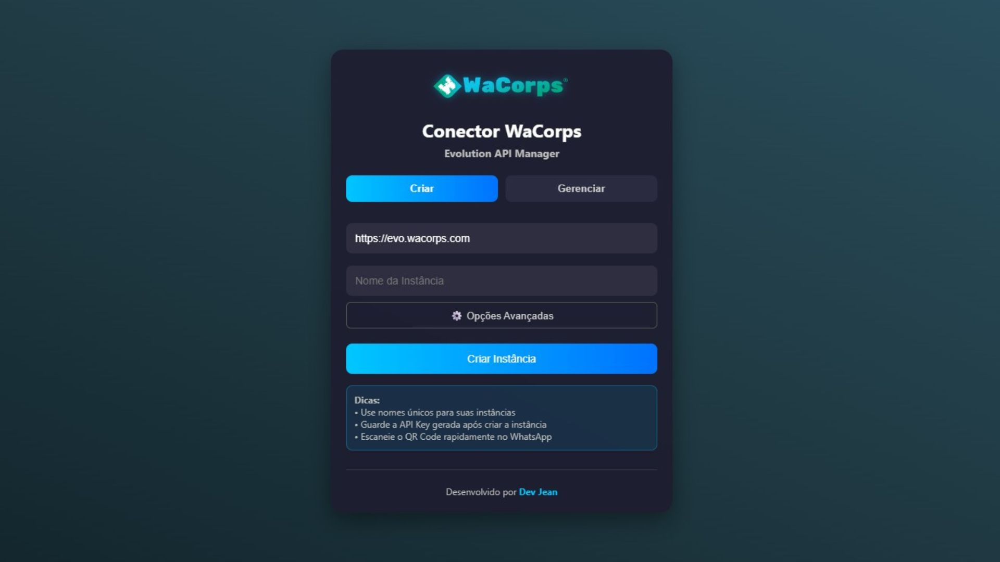
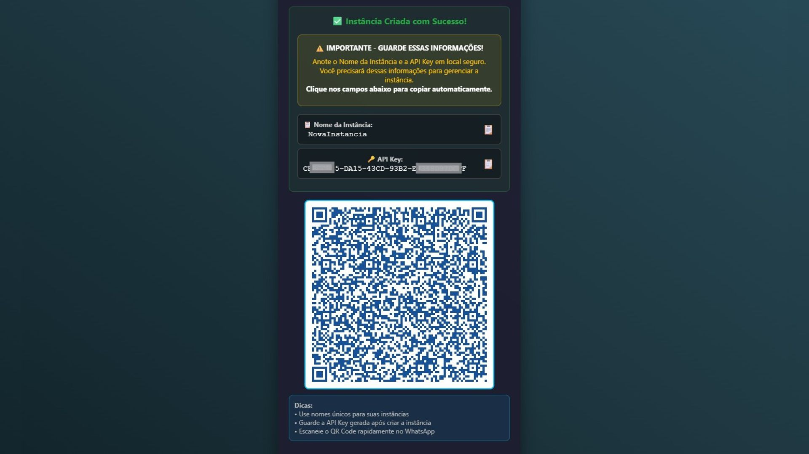
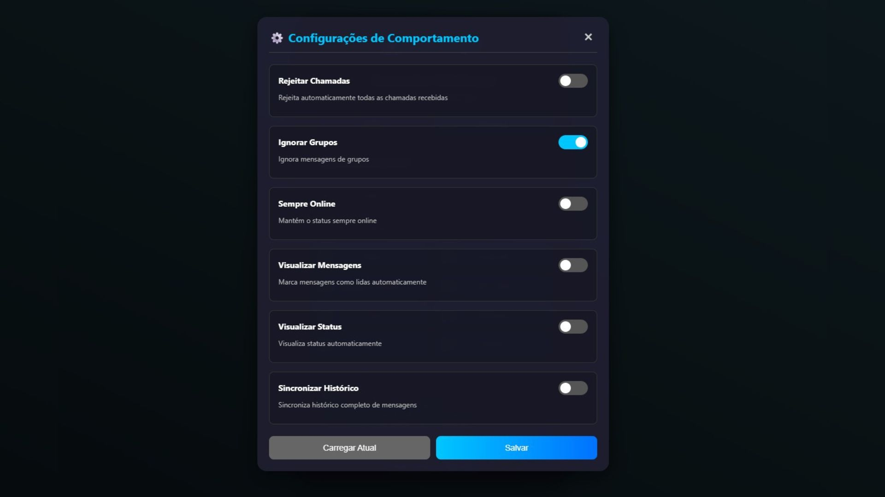
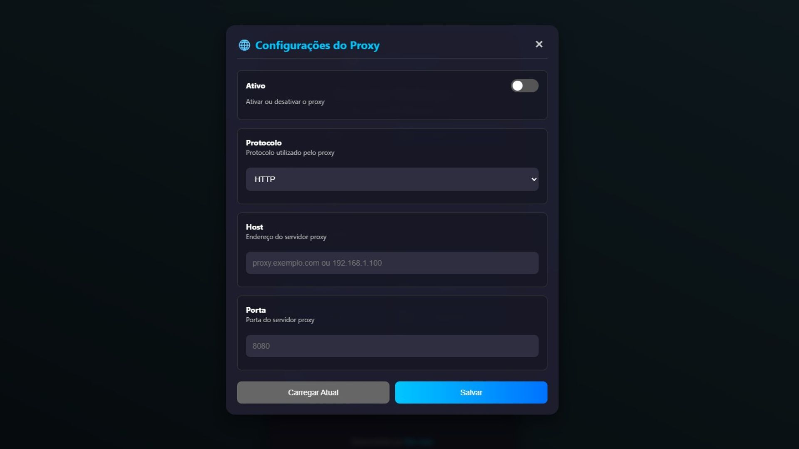
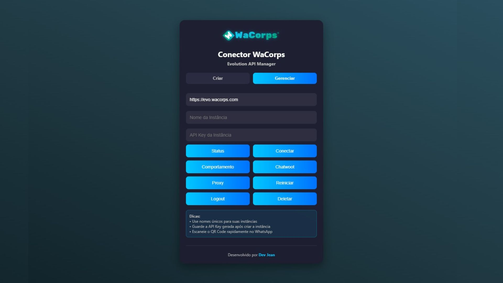

# Conector WaCorps

Uma interface web moderna e intuitiva para gerenciar instâncias da Evolution API WhatsApp, desenvolvida para facilitar a criação, configuração e gerenciamento de conexões WhatsApp através de uma interface amigável.

## 🚀 Características Principais

- **Interface Moderna**: Design responsivo com tema dark e gradientes
- **Segurança Avançada**: API Key criptografada com XOR + Base64
- **Gerenciamento Completo**: Criar, configurar, conectar e deletar instâncias
- **Configurações Avançadas**: Chatwoot, Proxy, comportamentos personalizados
- **QR Code Integrado**: Geração e exibição automática para conexão
- **Copiar Credenciais**: Sistema de cópia automática para clipboard
- **Responsivo**: Funciona perfeitamente em desktop e mobile


## 📋 Funcionalidades

### 🔧 Criação de Instâncias



- Configuração de integração (Baileys, Business, Evolution)
- Webhook personalizado
- Token customizado
- Configurações de comportamento durante a criação



### ⚙️ Configurações de Comportamento

- Rejeitar chamadas automaticamente
- Ignorar mensagens de grupos
- Manter status sempre online
- Visualizar mensagens automaticamente
- Visualizar status automaticamente
- Sincronização de histórico completo



### 💬 Integração Chatwoot

- Configurações básicas (URL, Account ID, Token)
- Configurações de mensagens (assinatura, delimitador)
- Configurações de conversa (pendente, reabrir)
- Importação de contatos e mensagens
- Configurações avançadas (organização, logo, JIDs ignorados)

### 🌐 Configurações de Proxy



- Suporte a HTTP, HTTPS, SOCKS4, SOCKS5
- Autenticação com usuário e senha
- Configuração de host e porta

### 📱 Gerenciamento de Instâncias

- Verificar status de conexão
- Gerar QR Code para conexão
- Reiniciar instância
- Fazer logout
- Deletar instância permanentemente



## 🔐 Configuração de Segurança da API Key

### Passo 1: Obter sua Global API Key

1. Acesse o Portainer, navegue até a sua Stack da Evolution API (v2), ou o painel que você utiliza
2. Copie sua Global API Key

### Passo 2: Gerar a Chave Criptografada

1. Abra o arquivo HTML em um editor de código
2. Localize a função comentada `generateMyEncryptedKey()`
3. Descomente a função
4. Substitua `"SUA_CHAVE_REAL_AQUI"` pela sua API Key real
   
```
   function generateMyEncryptedKey() {
  const originalKey = "SUA_CHAVE_REAL_AQUI"; // SUA CHAVE AQUI
  const keyOffset = 42;
  let encrypted = '';
  for (let i = 0; i < originalKey.length; i++) {
    encrypted += String.fromCharCode(originalKey.charCodeAt(i) ^ keyOffset);
  }
  const base64Encrypted = btoa(encrypted);
  console.log('SUA CHAVE CRIPTOGRAFADA:', base64Encrypted);
  return base64Encrypted;
}
```

### Passo 3: Executar a Criptografia

1. Abra o arquivo HTML no navegador

2. Abra o Console do Desenvolvedor (F12)

3. Digite: `generateMyEncryptedKey()` e pressione Enter

4. Copie o resultado exibido

### Passo 4: Configurar a Chave Criptografada

1. Substitua o valor de `encryptedApiKey` pelo resultado copiado:

```
const encryptedApiKey = "SEU_RESULTADO_CRIPTOGRAFADO_AQUI";
```

### Passo 5: Finalizar Segurança

1. Comente ou remova a função `generateMyEncryptedKey()`

2. Salve o arquivo

3. Sua API Key agora está protegida!

## 📖 Como Usar o Conector

### 🆕 Criando uma Nova Instância

1. **Acesse a Aba "Criar"**
    - A aba já vem selecionada por padrão

2. **Preencha os Campos Básicos**
    - **Base URL**: URL da sua Evolution API (ex: `https://evo.exemplo.com`)
    - **Nome da Instância**: Nome único para sua instância (apenas letras, números, _ e -) não pode conter espaços.

3. **Configure Opções Avançadas (Opcional)**
    - Clique em "⚙️ Opções Avançadas"
    - **Integração**: Escolha entre Baileys, Business ou Evolution
    - **URL do Webhook**: Configure webhook personalizado
    - **Token Personalizado**: Defina token específico

4. **Configure Comportamentos (Opcional)**
    - **Rejeitar Chamadas**: Rejeita automaticamente + mensagem personalizada
    - **Ignorar Grupos**: Ignora mensagens de grupos
    - **Sempre Online**: Mantém status sempre online
    - **Visualizar Mensagens**: Marca como lidas automaticamente
    - **Visualizar Status**: Visualiza status automaticamente
    - **Sincronizar Histórico**: Sincroniza histórico completo

5. **Criar a Instância**
    - Clique em "Criar Instância"
    - Aguarde o processamento
    - **IMPORTANTE**: Anote as credenciais exibidas!

6. **Salvar Credenciais**
    - Clique nos campos para copiar automaticamente
    - Guarde o Nome da Instância e API Key em local seguro

7. **Conectar WhatsApp**
    - Escaneie o QR Code no WhatsApp
    - Vá em: WhatsApp > Aparelhos Conectados > Conectar Aparelho
    - Escaneie o código em até 40 segundos
    - Se não conectar, demorar ou de algum erro, aperte no botão "Conectar" ou em "Status" para verificar

### 🔧 Gerenciando Instâncias Existentes

1. **Acesse a Aba "Gerenciar"**
    - Clique na aba "Gerenciar"

2. **Preencha as Credenciais**
    - **Base URL**: URL da sua Evolution API
    - **Nome da Instância**: Nome da instância existente
    - **API Key da Instância**: Chave obtida na criação

3. **Verificar Status**
    - Clique em "Status" para verificar conexão
    - Estados possíveis: Conectado, Desconectado, Conectando

4. **Conectar/Reconectar**
    - Clique em "Conectar" para gerar novo QR Code
    - Vá em: WhatsApp > Aparelhos Conectados > Conectar Aparelho
    - Escaneie o código em até 40 segundos
    - Se não conectar, demorar ou de algum erro, aperte no botão "Conectar" ou em "Status" para verificar

5. **Configurar Comportamento**
    - Clique em "Comportamento"
    - Configure as opções desejadas
    - Clique em "Carregar Atual" para ver configurações existentes
    - Clique em "Salvar" para aplicar mudanças

6. **Configurar Chatwoot**
    - Clique em "Chatwoot"
    - Configure integração com Chatwoot
    - Preencha URL, Account ID e Token
    - Configure opções avançadas conforme necessário

7. **Configurar Proxy**
    - Clique em "Proxy"
    - Configure proxy se necessário
    - Suporte a HTTP, HTTPS, SOCKS4, SOCKS5

8. **Operações de Instância**
    - **Reiniciar**: Reinicia a instância
    - **Logout**: Desconecta o WhatsApp da instância
    - **Deletar**: Remove permanentemente a instância

### 💡 Dicas Importantes

- **Nomes Únicos**: Use nomes únicos para suas instâncias, não pode conter espações

2. **Guardar Credenciais**: Sempre anote o Nome da Instância e API Key

3. **QR Code Rápido**: Escaneie o QR Code rapidamente (40 segundos)

4. **Backup Configurações**: Anote suas configurações importantes

5. **Teste Conexão**: Sempre teste o status após configurar

### ⚠️ Avisos de Segurança

- Nunca compartilhe sua API Key

- Mantenha as credenciais em local seguro

- Use nomes de instância que não revelem informações sensíveis

- Faça backup das configurações importantes

## 🛠️ Tecnologias Utilizadas

- **HTML5**: Estrutura moderna e semântica

- **CSS3**: Estilos avançados com gradientes e animações

- **JavaScript ES6+**: Funcionalidades modernas e assíncronas

- **Fetch API**: Requisições HTTP nativas

- **Clipboard API**: Cópia automática para área de transferência

- **CSS Flexbox**: Layout responsivo

- **CSS Grid**: Organização de elementos

## 📱 Compatibilidade

- ✅ Chrome 60+

- ✅ Firefox 55+

- ✅ Safari 12+

- ✅ Edge 79+

- ✅ Mobile (iOS/Android)

## 🔒 Segurança

- API Key criptografada com XOR + Base64

- Validação de entrada de dados

- Sanitização de parâmetros

- Confirmações para ações destrutivas

- Headers de segurança nas requisições

## 📝 Licença

Este projeto foi desenvolvido por [Dev Jean](https://devjean.com.br/) 
Todos os direitos reservados. Este software é propriedade de Jean Carlos Krause. O uso, cópia, modificação, ou redistribuição não são permitidos sem autorização expressa por escrito.

## 🆘 Suporte

Para suporte técnico ou dúvidas, visite: [https://devjean.com.br](https://devjean.com.br/)

**Desenvolvido com ❤️ por [Dev Jean](https://devjean.com.br/)**
